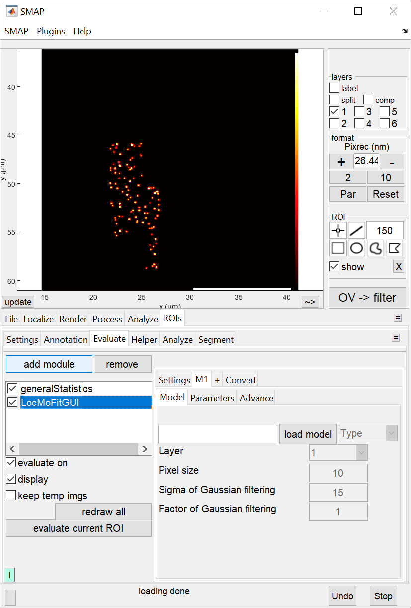
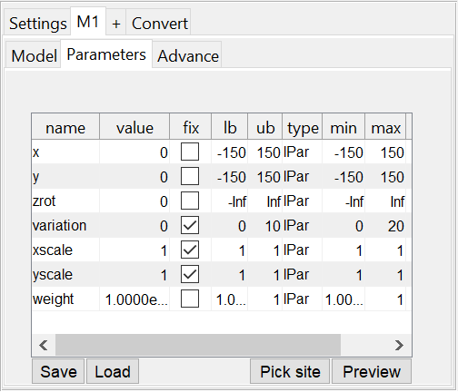
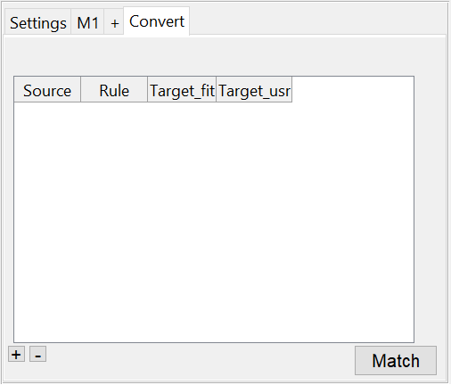
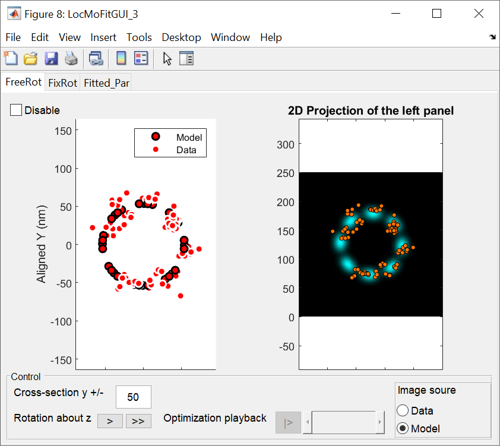
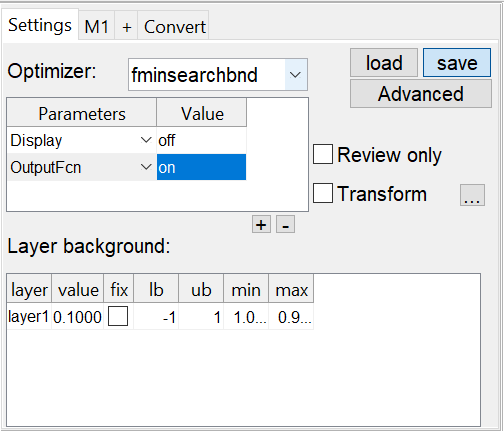
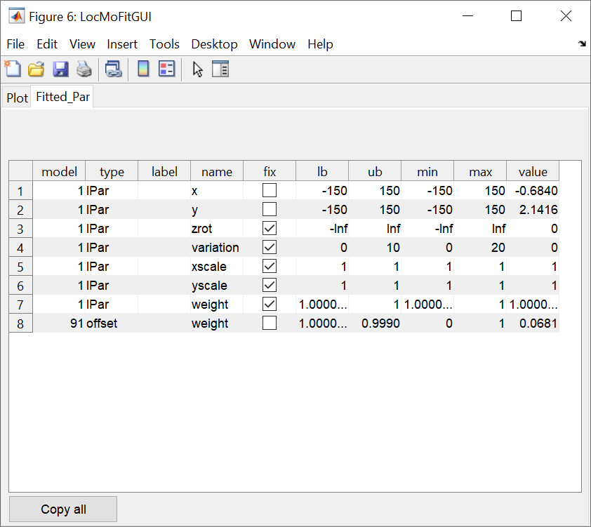
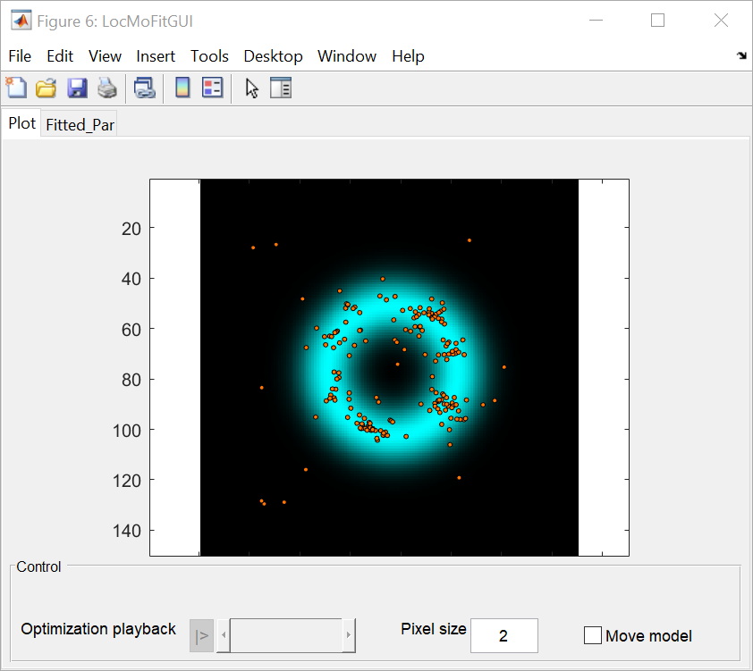

# Graphic user interface (GUI)
## GUI overview

LocMoFit is integrated into SMAP. You can follow the steps to access to LocMoFit in SMAP:
1. Go to the **[ROIs]** tab.
2. Go to **[Evaluate]** tab and click **add module**.
3. In the popup window, select _LocMoFitGUI_ and click *ok*.

Now the SMAP window should look like the image above.
There are three main tabs in the LocMoFit GUI: **[Settings]**,**[M1]**, and **[Convert]** and a button **[+]**.
:::{Note}
 The button **[+]** here allows you to add one more model.
:::

Here I will introduce them in the order of a routine workflow.

### Tab _[M1]_: Model 1
This is the first tab you will see once the module _LocMoFitGUI_ is added.
In this tab, you can load and set up the first SMLM model.

#### Sub-tab _[Model]_
 * a button **load model** allows you to load a SMLM model.
 * a pop-up menu _Type_ allows you to specify the model type. You can find out more about the model types {doc}`here<../basics/geometricModel>`.
 * a pop-up menu _Layer_ allows you to define which layer this model will be fitted to.
 * a field _Pixel size_ for you to define the pixel size. This only applies to an _image_ or _continuous_ model.
 * a field _Sigma of Gaussian filtering_ where you can specify a constant sigma of Gaussian filtering. The higher the more blurred.
 * a field _Factor of Gaussian filtering_ where you can specify the factor of Gaussian filtering. The higher the more blurred.
:::{Note}
 _Sigma of Gaussian filtering_ and _Factor of Gaussian filtering_ works exclusively.
:::

#### Sub-tab _[Parameters]_

If you already loaded a model, you can move on to this tab and set up the model parameters.
Here you will see the following:
 * the main table where you can set up the model parameters. See {doc}`parameter table<../basics/parTable>` for more details.
 * buttons **Save** and **Load** allow you to save and load settings.
 * a button **Pick site** allows you to click a site in the ROI manager without evaluating the fit. This is usually used together with the button _Preview_
 * a button **Preview** to show the model with the initial parameters.
 
##### Description of the fields
* _name_: parameter names.
* _value_: initial values of parameters.
* _fix_: specify the parameter should be fix or or not. If checked, the parameter will be set to the value you defined and will be a constant that are not fitted.
* _lb_: relative lower boundaries of parameter ranges.
* _ub_: relative upper boundaries of parameter ranges.
* _type_: types of parameters. This is not editable.
* _min_: absolute lower boundaries of parameter ranges.
* _max_: absolute upper boundaries of parameter ranges.
* _label_: user-defined labels for the corresponding parameters.

   :::{note}
   For example, _value_ 30, _lb_ -10, _ub_ 20, _min_ 10, and _max_ 45 results to a parameter range of [20 45]. This is based on first get [value+lb value+ub] = [20 50], and then check whether this is beyond [min max] = [10 45] or not. If this is the case, the range will be set to the min or max values so the final upper boundary is 45 but not 50.
   :::
 
#### Sub-tab _[Advance]_

You can set up the advanced settings here. The setting items are model-specific.
Here you will see the following:
 * the main table where you can set up the advanced settings. You can choose a setting item that you want to modify in the column _Setting_ and define its value in the column _Value_.
 * buttons **+** and **-** allows you to add/remove a setting item.

:::{Note}
 You can click the button **[+]** next to the tab label **[M1]** to add one more model as **[M2]**.
:::

### Tab _[Settings]_

In this tab, you can set up settings beyond specific models and have a global control of the current LocMoFitGUI instance.
Here you will see the following:
 * a pop-up menu _Optimizer_ allows you to define which optimizer to use.
 * a table of _optimizer parameters_ and buttons **+** and **-**. Here you can define parameters of the optimizer. Use **+**/**-** to add or remove a parameter.
 * buttons **load** and **save** allow you to load and save the entire settings.
 * a button **advanced** for advanced settings. Usually you don't have to touch this part. If you click it, you will get a list of advanced settings in a new pop-up window.
 * a checkbox _Review only_. Check it if you have fitted the current site and just want to review the fit.
 * a checkbox _Transform_. Check it if you would like to transform the site based on the model with the final parameter estimates.
 * a table of _Layer background_. This is similar to a general {doc}`parameter table<../basics/parTable>`.

### Tab _[Convert]_

Instead of constants, you can define initial parameters with user-defined rules here.
Here you will see the following:
 * the main table where you can set up the rules for converting them to parameter values. The meanings of the columns:
    * _Source_: source LocMoFitGUI instance/step.
	* _Rule_: rules for defining the target.
	* _Target_fit_: target parameters in the fit.
	* _Target_usr_: target temporal user-defined variables.
 * buttons **+** and **-** allow you to add or remove a rule.
 * a button **Match** for matching the parameters with the same names from a previous step. These define the value of matched ones based on the final estimates of the previous step.
 
:::{Note}
 If you defined a conversion rule here for a parameter, the initial value of the parameter defined in the sub-tab [Mxx]/[Parameters] will be ignored.
:::

## Fit viewer
After the current site is fitted, the fit viewr will show if the **display** is checked.
This viewer is different per model type and data dimension.

### For 3D continuous/discrete models
You should see this window show up:

#### Tab _[FreeRot]_
There are different parts:
* a checkbox **Disable**. For efficiency, you can check it so that the plots will not be drawn.
* the left panel _Dot plot_. Here both the model and the data are represented by dots.
* the right panel _2D Projection of the left panel_. Here either one of the model or the data is rendered as a image. You can specify the image source bellow in the panel _Control_.
* the bottom panel _Control_. Here you can:
   * define the thickness of the cross-section along the y-axis.
   * rotate the site about z-axis with the buttons *>* and *>>* in small and large steps, respectively.
   * You can playback the process of optimization if its history is saved.
      :::{Note}
      You can enable the history saving by turning on the _OutputFun_ in the table _optimizer parameters_
	  
	  
      :::

#### Tab _[FixRot]_
:::{Note}
By defualt, this tab is disabled. You can uncheck the checkbox **Disable** to show the content.
:::
* a checkbox **Disable**. For efficiency, you can check it so that the plots will not be drawn.
* four panels of the fitted site with different rotation angles around the z-axis.

#### Tab _[Fitted_Par]_
:::{Note}
For each viewer, it comes with a tab **[Fitted_Par]** regardless of the model type:

:::
* the main table that displays the parameters settings with parameter estimates shown in the column _Value_.
* a button **Copy all** allows you to copy the entire table to the clipboard.

### For 3D image models
You should see this window show up:

There are three tabs of projections of the site in different views (planes **[XY]**, **[YZ]**, and **[XZ]**) and the common tab **[Fitted_Par]**.

### For 2D models
You should see this window show up:

There are two tabs:
* **[Plot]** showing the data as points and the model as an image. In the control panel:
   * You can playback the process of optimization if its history is saved.
   * You can define the pxiel size for rendered image above.
   * Normally the data is transforemd. You can transform the model instead by checking the checkbox **Move model**.
* the common tab **[Fitted_Par]**.