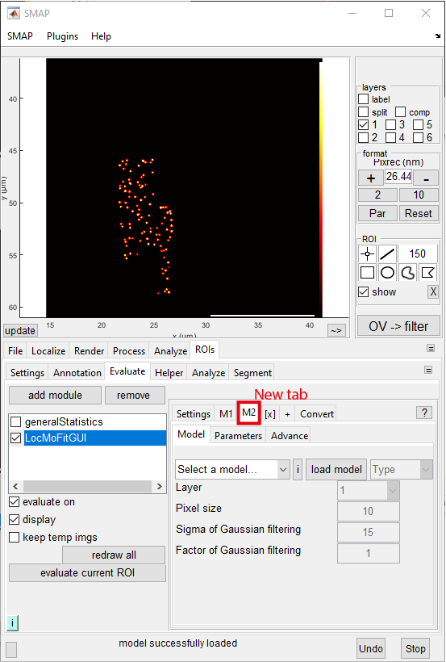
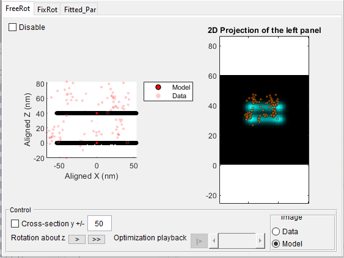
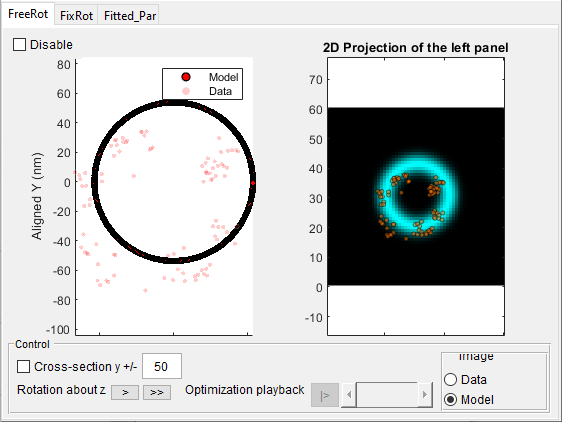
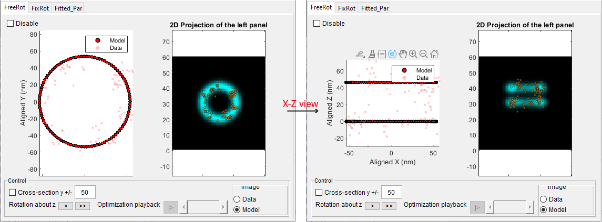
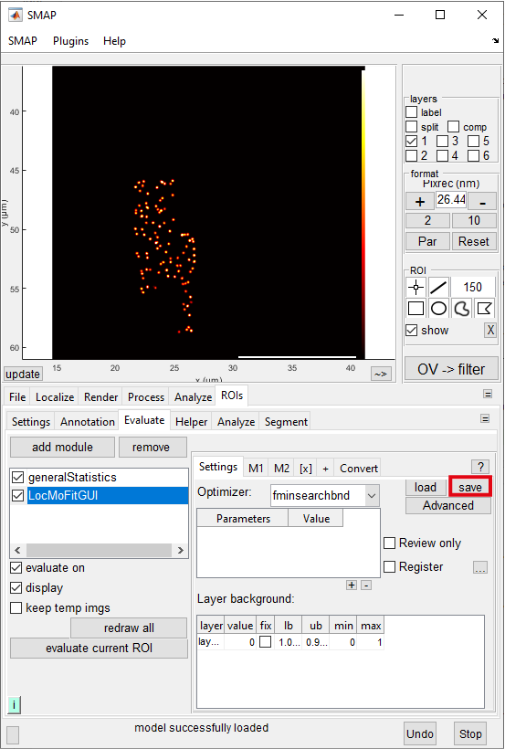

# Composite model

:::{note}
Time required: ~15 min.
:::

In {doc}`quick start<../tutorial/quickstart>`, we fitted a 2D ring to single nuclear pore complexes (NPCs). However, in 3D, there are actually two parallel rings per NPC (which can be seen in the side view). To extract parameters such as the distance between the two rings, a different geometry is required. Normally, this would require the user to create a new file with some coding. However, this particular geometry can be derived from the existing one (i.e., twice the 2D ring in 3D). Building a composite model by combining existing ones without coding is supported by LocMoFit.

## Task
Building a composite model with the GUI. We will build a 3D dual-ring model by combining two times the identical ring model {class}`ring3D<models.ring3D>`.
	
## Requirement
* Software: **SMAP** installed. Further information can be found on our [GitHub](https://github.com/jries/SMAP/) site.
* Localization data: _U2OS_Nup96_BG-AF647_demo_sml.mat_
* Fitting settings:
	* _dualRing_model1_fitPar.csv_

The data and setting files can be downloaded [here](https://www.embl.de/download/ries/LocMoFit/).

## Main tutorial

### Preparation
1. Start SMAP ({doc}`how to? <../howto/SMAP.runSMAP>`).
	:::{important}
	If you continue from the previous tutorial, please close the current SMAP and start a new session.
	:::
2. Load the dataset _U2OS_Nup96_BG-AF647_demo_sml.mat_.
3. Load an instance of the plugin **LocMoFitGUI** (see {doc}`quick start<../tutorial/quickstart>` if you forget how to do it).

### Setup
We will combine two identical rings in 3D ({class}`ring3D<models.ring3D>`) to form a 3D dual-ring model.

1. We first load the individual models and set up the arguments of the model parameters. Now for the first ring model:
	* Go to **[M1]** -> **[Model]**, click the drop-down menu (where _select the model..._ is shown), and then select _ring3D_. Click **load model**. 
	* Go to the tab **[Parameters]** and click the button **Import**. In the new window, navigate to the settings directory and open dualRing_model1_fitPar.csv. Click **Import** button in the popup window.
		
		
		
		:::{note}
		In the new window, the saved parameters (the field **import**) are matched to the parameters (the field **to**) in the GUI based on the same names and model types. We will discuss this more in step 2.
		:::
		:::{hint}
		Now you loaded a previously exported parameter settings. In LocMoFit, you don't have to manually input the parameters every time. You can save the current settings through the **Export** button and use them for the next time.
		:::

2. Now you have to tell LocMoFit that we need to add a second model:
	* To add the second model tab **[M2]**, click **[+]** next to **[[x]]**:
	
	
	
	* You are now in **[M2]** -> **[Model]**. Click the drop-down menu (where _select the model..._ is shown), select _ring3D_, and then click **load model**. 
	* Go to the tab **[Parameters]** and set all **fix** to _true_ except for the parameter _z_. Next, change the **value** of _weight_ to 1. Also change the **value**, **lb**, and **ub** of _z_ to 40, -40, and 60. Now the table should look like this (non-default values are in bold):
	
	| name | value | fix | lb | ub | type | min | max |
	| --- | --- | --- | --- | --- | --- | --- | --- |
	| x         | 0 | **☑** | -150 | 150 | lPar | -150 | 150 |
	| y         | 0 | **☑** | -150 | 150 | lPar | -150 | 150 |
	| zrot      | 0 | **☑** | -Inf | Inf | lPar | -Inf | Inf |
	| variation | 0 | ☑ | 0 | 10 | lPar | 0 | 20 |
	| xscale    | 1 | ☑ | 1 | 1 | lPar | 1 | 1 |
	| yscale    | 1 | ☑ | 1 | 1 | lPar | 1 | 1 |
	| weight    | **1** | ☑ | 1.0000e-05 | 1 | lPar | 1.0000e-05 | 1 |
	| z         | **40** | ☐ | **-40** | **60** | lPar | -300 | 300 |
	| xrot      | 0 | **☑** | -Inf | Inf | lPar | -Inf | Inf |
	| yrot      | 0 | **☑** | -Inf | Inf | lPar | -Inf | Inf |
	| zscale    | 1 | ☑ | 1 | 1 | lPar | 1 | 1 |
	| radius    | 53.7000 | ☑ | 0 | 0 | mPar | 0 | 100 |
	
	:::{important}
	**Why are there so many values zero?** Zeros mean that those parameters share the same values as M1. When there is more than one model, the extrinsic parameters (_lPar_) are always defined relative to the M1. For example, we set the **value** of _z_ of M2 to 40 nm in order to move it 40 nm away from M1 in _z_, having the two rings separate.
	:::

3. To have better starting parameters, you may not want to always set the xy positions to zero. Instead, they can be roughly estimated based on the median position of the localizations. To take the median values as the starting parameters, you can use the functionality **Convert**, which dynamically converts from a *Rule* to the starting value of a parameter specified in **Target_fit**.
	* Go to tab **[Convert]** and fill in the table as the following (you can use the **+** button to add a new row):
	
	| Source    | Rule             | Target\_fit | Target\_usr |
	| --------- | ---------------- | ----------- | ----------- |
	| this step | median(locs.xnm) | m1.lPar.x   |             |
	| this step | median(locs.ynm) | m1.lPar.y   |             |
	| this step | median(locs.znm)-40 | m1.lPar.z   |             |
	
	:::{note}
	Here we assign the median (xnm, ynm, and znm refer to the values on the respective coordinate axis, in nanometer) position of localizations (locs) as the initial parameters for the center position of model 1 (e.g., m1.lPar.x means the x position of model 1). Model 1 is additionally shifted 40 nm down in z.
	:::

4. Now preview the model _before fitting_ for site 1 (see {doc}`quick start<../tutorial/quickstart>` if you forget how to do it). The expected result: 
	
	
	
	:::{tip}
	**In the viewer, how do I explore the model in 3D ?** In the scatter plot on the left, you can either hold the left-click and drag or right-click and select views:
	
	
	:::
	
	Go to X-Y view, you will see the side view of the model:
	
	

### Fitting
1. To disable the preview mode, uncheck **preview** in the tab **[Parameters]**.
	
2. In the _ROI Manager_ window, click on one site and wait for a few seconds. You should see the updated _LocMoFitGUI_ window displaying the fitted model:

	

:::{note}
To see the effect of fitting, you can compare the model before and after fitting with/without the preview mode on. 
:::

### Saving all settings
You can save the current settings, including the loaded models, parameter settings, and converter, for the same task next time:
* Go to **[Settings]**, click on the button _save_, navigate to where you want to save the settings, and save it as _NPC3D_step1_dualRings_LocMoFit.mat_:

	

Congratulations! Now you retain the settings of the composite model you built for the first time.

### Next tutorial
You are in the introductory series. The next tutorial is {doc}`Chaining steps<./chainSteps>`
