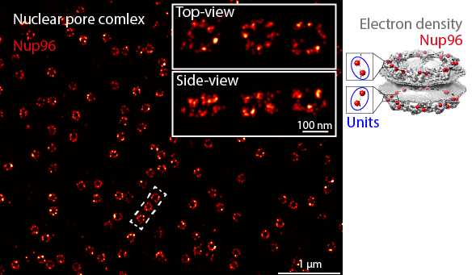
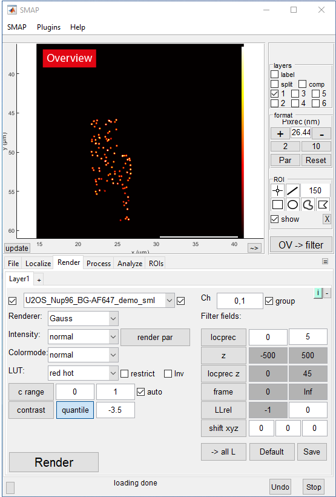
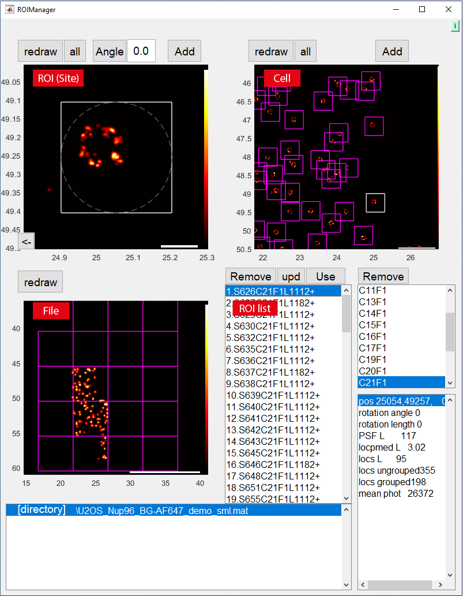
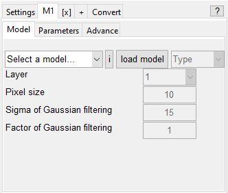
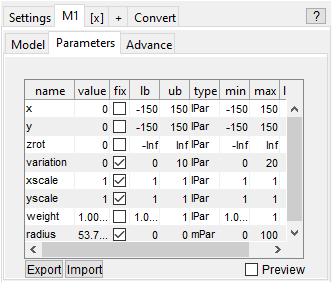
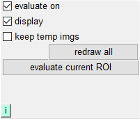
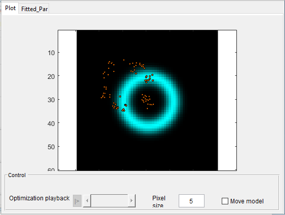

# Quick start

:::{note}
Time required: ~10 min.
:::

LocMoFit fits a geometry to single structures in SMLM data. In this tutorial, you will learn how to do this with the LocMoFit GUI in SMAP ({doc}`what is SMAP? <../basics/SMAP>`).

We will be using the nuclear pore complex (NPC) as the example. This complex appears as rings if you see them in the top view.

## Task
Fitting a 2D ring model to the top-view projection of NPCs to find their positions.

## Requirement
* Software: SMAP installed. Further information can be found on our [GitHub](https://github.com/jries/SMAP/) site.
* Localization data: _U2OS_Nup96_BG-AF647_demo_sml.mat_

The mat file can be downloaded [here](https://www.embl.de/download/ries/LocMoFit/).

## Main tutorial

### Preparation
1. Start **SMAP** ({doc}`how to? <../howto/SMAP.runSMAP>`).
2. Load the localization data ({doc}`how to?<../howto/SMAP.loadData>`) _U2OS_Nup96_BG-AF647_demo_sml.mat_. This file contains segmented nuclear pore complexes that you will be analyzing in the following steps.
:::{note}
**How was the segmentation done?** You can check out all the pre-processing steps from _fitting raw data (raw camera frames)_ to _segmentation of NPCs_ in [**SMAP_manual_NPC.pdf**](https://www.embl.de/download/ries/Documentation/SMAP_manual_NPC.pdf).
:::

The current window:

You should see the data set displayed in the **Overview**.

### Warm-up
Before fitting, let's explore the data a bit first. We can find the list of segmented NPCs in the **ROIManager**:
1. Go to **[ROI]** -> **[Settings]**, click **show ROI manager**. This opens the **ROIManager** in a new window.
	:::{Note}
	**ROIManager** allows you to manage ROIs in different cells and files. Check section 8.2 (_Manually generating a list of ROIs_) in [**SMAP_manual_NPC.pdf**](https://www.embl.de/download/ries/Documentation/SMAP_UserGuide.pdf) for more information.
	:::
2. Click a few sites in the ROI list to display them.

	

### Loading LocMoFit
Let's now start to work with LocMoFit by loading it into SMAP:
:::{include} ../howto/SMAP.loadLocMoFit.md
---
start-line: 1
---
:::
:::{note}
The button  in the up-right corner of the LocMoFit GUI provides you details of fields and buttons in the current tab/sub-tab.
:::

### Setup
We will be using the in-built model {class}`ring2D<models.ring2D>` here ({doc}`more about model types<../basics/geometricModel>`).
1. First, we have to load the model into LocMoFit:
	* In the right panel, go to **[M1]** -> **[Model]**, click the drop-down menu (where _selet the model..._ is shown), and then select _ring2D_.
	
		
   
	* Click **load model**. Now the model is loaded.
	:::{note}
	**M1** stands for model 1. Find out more about the M1 tab [here](../basics/GUIOverview.html#tab-m1-model-1). LocMoFit allows you to load multiple models and combine them into a single composite model, which you will learn in the next tutorial.
	:::
	
	:::{Note}
	Clicking the button  next to the drop-down menu opens the webpage detailing the selected model.
	:::
	
2. The we set up the parameter settings:
	* Go to the tab **[Parameters]**

		

	* Fill in the table as followed:
	
	| name | value | fix | lb | ub | type | min | max |
	| --- | --- | --- | --- | --- | --- | --- | --- |
	| x         | 0 | ☐ | -150 | 150 | lPar | -150 | 150 |
	| y         | 0 | ☐ | -150 | 150 | lPar | -150 | 150 |
	| zrot      | 0 | ☑ | -Inf | Inf | lPar | -Inf | Inf |
	| variation | 10 | ☑ | 0 | 10 | lPar | 0 | 20 |
	| xscale    | 1 | ☑ | 1 | 1 | lPar | 1 | 1 |
	| yscale    | 1 | ☑ | 1 | 1 | lPar | 1 | 1 |
	| weight    | 1 | ☑ | 1e-05 | 1 | lPar | 1e-05 | 1 |
	| radius    | 53.7 | ☑ | 0 | 0 | mPar | 0 | 100 |
	
	:::{Important}
	**What do all these different elements mean?** Let's start with the fields **name** and **type**. **name** shows parameter names. **type** indicates the types of parameters:
	
	* **lPar**: extrinsic parameters, which are independent of the geometries. These parameters therefore apply to different geometries.
	* **mPar**: intrinsic parameters, which determine the shape of the geometry and therefore are geometry-specific.
	
	Parameters _x_ and _y_ are the xy coordinates of the model with respective to the center of the ROI. _zrot_ is the rotation around the z-axis. xscale and yscale are the scaling of the model along the respective axes. _variation_ is the extra variation, the uncertainties that cannot be solely explainied by the localization precision. It basically defines how blurred the model is.
	The field **fix** indicates each parameter is fixed to a specific value or not. If checked, the correspoinding parameter will not be estimated but fixed to the value defined in the field **value**.
	
	The field **value** defines the initial values of the parameters. The fields **min** and **max** define the search range of a parameter. We will disscuss other fields later.
	:::
	With the settings, now you defined a ring with radius = 53.7 nm. The ring can be moved in the xy plane freely from -150 to 150 nm.

### Preview
In practice, you often have to optimize the fitting settings, especially finding good initial parameters. In this case, previewing the model with the initial parameters is useful.

1. To active the preview mode, check the checkbox **preview** in the bottom-left corner of the tab **[Parameters]**.

2. Go back to **[Evaluate]**, make sure that **evaluate on** and **display** in the left panel are checked.
	:::{Note}
	* The loaded modules will be evaluated only when **evaluate on** is checked.
	* Result windows of the loaded modules will be displayed only when **display** is checked.
	
		
	:::

3. Now click on the first ROI in the _ROI manager_ window and wait for a few seconds. You should see a new window _LocMoFitGUI_, in which the localizations are plotted on the initial model.

	

4. You can explore the data more by repeating these steps for a few more ROIs.

### Fitting
Next, we will execute the fitting. This is done by clicking the site in the list of sites in the _ROI manager_ window with the preview box unchecked:

1. Go back the tab **[Parameters]** and uncheck **preview**.
	
2. In the _ROI Manager_ window, click on one site and wait for a few seconds. You should see the updated _LocMoFitGUI_ window displaying the fitted model.
	
	:::{Note}
	The **LocMoFitGUI** window allows you to inspect the result right after fitting. The window may look different depending on the model type.
	:::
Now you have your first fit done! Congratulations! You should see the previously uncentered structure now centered becasue the fit finds the position of the structure. You can further explore a few sites to get familiar with the interface.

### Next tutorial
You are in the introductory series. The next tutorial is {doc}`Composite model<../tutorial/compositeModel>`.
